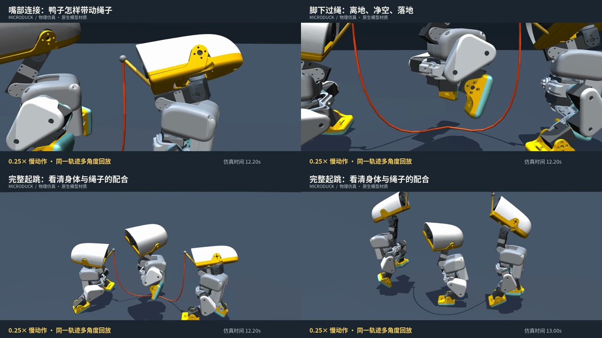

# MicroDuck · 三只小鸭，一根跳绳

**两只用嘴部连接带动绳子，一只找准时机起跳。** 基于 Pollen Robotics Microduck 的 MuJoCo 三机器人跳绳项目，使用学习策略、绳位反馈和真实柔性绳接触。

**最新结果：8 组测试共 442 / 516 圈合格（85.7%）。** 每组 30 秒，前 9 秒启动阶段不计；5 组通过，3 组仍低于 80%。这是指定仿真配置的批次结果，不代表任意初始状态或真实硬件上的成功率。

## 先看视频

[](https://github.com/ros-claw/microduck/blob/main/out/microduck_social.mp4)

*点击动图观看竖版发布视频。模型使用原生白色外壳、黄色嘴和脚、浅青色脚底。*

[](https://github.com/ros-claw/microduck/blob/main/out/microduck_closeups.mp4)

| 视频 | 内容 |
| --- | --- |
| **[特写慢动作 · 18 秒](out/microduck_closeups.mp4)** | 嘴部连接、脚下过绳、完整起跳；跟随目标的近景镜头，0.25× 回放 |
| **[竖版发布片 · 14.8 秒](out/microduck_social.mp4)** | 1080 × 1920 / 50 fps，完整配合与慢动作剪辑，含后期拟音 |
| [横版完整过程 · 20 秒](out/microduck_studio_full.mp4) | 1920 × 1080 / 50 fps，保留启动过程，连续实速，无声 |
| [竖版无声素材](out/microduck_social_silent.mp4) · [封面](out/microduck_cover.jpg) | 便于自行剪辑配乐 |

[发布文案与剪辑说明](docs/PUBLICATION.md)。视频均为物理仿真，慢动作有明确标注；特写重复展示同一段轨迹，不是额外独立测试。MP4 链接可在 GitHub 文件页播放或下载，动图用于 README 内直接预览。

## 什么是真的，什么仍有限制

- **嘴连绳、鸭子驱动：** 绳端连接两只鸭嘴部把手，学习策略通过身体和头部运动驱动绳子；当前演示不使用隐形载具驱动绳子。
- **真实接触：** 柔性绳与鸭子、地面启用碰撞。合格圈要求完整转绳、双脚实际穿越及脚底净空、无绳鸭接触、稳定支撑落地、嘴部连接正常且不倾倒。碰撞存在数值容差，不宣称绝对零穿透。
- **学习策略 + 显式协调：** 跳跃者使用接触训练后的 ONNX 策略，转绳策略配合几何相位反馈，上限 3.1 Hz；尚不是完全独立的多智能体端到端学习。
- **结果可追溯：** 视频这次启动后为 33 / 33 圈；美化前后逐圈记录一致。批次结论仍以全部 8 组为准，失败种子没有从统计中删除。
- **仍需改进：** 起旋与扰动鲁棒性、失败后的恢复，以及部分种子的擦绳、净空和落地支撑不足。

[多组原始成绩](artifacts/takeover/contact-summary.json) · [训练与消融记录](docs/SWEEP_TRAINING.md) · [视频核验](artifacts/presentation/audit.json)

## 快速复现

已验证环境：Linux、Python 3.13、MuJoCo 3.12；评估可在 CPU 运行，EGL 渲染可使用 NVIDIA GPU。无需重新训练即可运行已交付策略。

```bash
git clone https://github.com/ros-claw/microduck.git
cd microduck
python3 -m venv .venv
.venv/bin/python -m pip install -e '.[dev]'

# 独立资产目录，避免与交付仓库同名；后续命令保持这个环境变量
export MICRODUCK_ROOT="$PWD/.assets"
.venv/bin/python scripts/bootstrap.py

# 默认 seed 0 / 30 秒，逐物理步评估，不渲染
scripts/contact_skip.sh

# 回归测试
.venv/bin/python -m pytest tests -q
```

初始化从 `upstream.lock.yaml` 的固定提交获取官方模型和基础策略；已有资产仓库会保留当前分支与修改，不自动切换。若自行提供资产，请确保与固定模型兼容。输出为 `artifacts/takeover/contact-latest.json`。

```bash
# 捕获已验证轨迹，导出横版、竖版和封面
# Ubuntu 字体依赖：fonts-noto-cjk；需要可用的 EGL / OpenGL 驱动
MUJOCO_GL=egl PYOPENGL_PLATFORM=egl OPENBLAS_NUM_THREADS=1 \
  .venv/bin/python scripts/publish_contact_video.py --capture

# 在同一轨迹上导出三个特写，不改变物理动作
MUJOCO_GL=egl PYOPENGL_PLATFORM=egl OPENBLAS_NUM_THREADS=1 \
  .venv/bin/python scripts/render_closeups.py
```

状态以 200 Hz 捕获，四分之一速输出 50 fps，直接回放保存的状态，不插值关节。没有 EGL 时可同时将两个 GL 环境变量设为 `osmesa`，需要系统 OSMesa 库，速度较慢。

## 项目导航

| 目录 / 文件 | 用途 |
| --- | --- |
| `src/microduck_lab/sim/` | 三鸭世界、柔性绳、策略运行时、严格跳绳评分 |
| `src/microduck_lab/demos/honest_skip.py` | 当前三鸭部署与时序协调 |
| `scripts/contact_skip.sh` | 最终接触配置的单一评估入口 |
| `scripts/publish_contact_video.py`、`scripts/render_closeups.py` | 轨迹核验与视频制作 |
| `policies/ropehop_contact.onnx`、`policies/turner_rope.onnx` | 当前跳跃与转绳策略 |
| **[training/](training/README.md)** | 训练源码补丁、固定基线、恢复方式与限制 |
| `artifacts/takeover/`、`artifacts/presentation/` | 测试证据、逐圈记录、视频参数与哈希 |
| `out/`、`docs/media/` | 发布视频、封面、README 预览 |
| [文档索引](docs/README.md) | 当前结果、发布说明与历史实验的阅读顺序 |

早期的蛇形扫绳、无接触时序命中率和旧策略仅作为历史保留，不能替代当前验收。旧 README 已移至 [历史存档](docs/README_LEGACY.md)。本地失败候选视频、渲染缓存、训练日志不属于发布入口。

## 致谢与许可

项目代码：Apache-2.0。机器人模型与原生材质来自 [Pollen Robotics Microduck](https://github.com/pollen-robotics/microduck) 及其 [训练仓库](https://github.com/pollen-robotics/microduck_rl)，模型许可与固定来源见 [upstream.lock.yaml](upstream.lock.yaml)，不将原始模型资产打包入本仓库。基础策略来自官方运行时；新增跳跃与转绳权重随项目提供。感谢原 ROSClaw 原型和社区参考实现 quackd。
