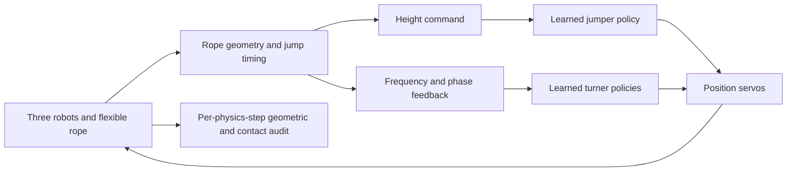

# MicroDuck: Cooperative Rope Skipping in MuJoCo

**English** | [简体中文](README.zh-CN.md)

MicroDuck is a simulation project for studying contact-aware locomotion and coordination between three bipedal robots. Two Microduck robots drive a flexible rope through handles attached to their mouths; a third robot learns to jump over it. The system combines reinforcement-learned motor policies, explicit phase feedback, and a geometric/contact-based evaluator.

The central problem is to make **rope rotation, foot clearance, and supported landing work together under physical contact**. A correctly timed jump alone is insufficient: the rope must pass below both feet, the robot must land cleanly, and the rope must remain attached to its turners.

This repository provides the deployment runtime, exported policies, evaluation evidence, rendering tools, and a reproducible patch containing the training implementation. It is a **MuJoCo simulation**, not a demonstrated hardware deployment or an end-to-end multi-agent RL system.

[Method](#method) · [Evaluation](#evaluation) · [Getting started](#getting-started) · [Training](#training) · [Repository structure](#repository-structure)

## Demonstration

[English overview: method, close-ups, and results](out/microduck_youtube_en.mp4) · [English video description](docs/YOUTUBE_EN.md)

[](out/microduck_studio_full.mp4)

[Continuous 20-second rollout](out/microduck_studio_full.mp4) · [Mouth attachment and foot-clearance close-ups](out/microduck_closeups.mp4) · [Vertical demonstration](out/microduck_social.mp4)

The continuous rollout includes startup. Close-ups replay the same trajectory at 0.25× speed; they are not additional evaluation runs. Rendering uses the assets' original materials. Presentation changes were checked against the original per-cycle audit, with identical results. See the [trajectory audit](artifacts/presentation/audit.json) and [rendering metadata](artifacts/presentation/manifest.json).

## Method

### 1. Shared physical environment

Three copies of the official Microduck model and a segmented flexible rope are simulated in one MuJoCo world. Rope endpoints are connected to mouth-held handles using equality constraints. Ball joints allow the rope segments to bend and twist. The current configuration enables rope–robot and rope–ground collisions from initialization, with no mocap carriers driving the rope and no rope-velocity clipping.

| Component | Current configuration |
| --- | --- |
| Robot actuation | 14 position-controlled servos per robot |
| Policy execution | 50 Hz, ONNX Runtime |
| Physics integration | 0.2 ms timestep, Euler integration, Newton solver |
| Rope | 0.58 m length, 1.5 mm collision radius, ball-joint chain |
| Coordination | Measured rope phase and jump timing; turn frequency capped at 3.1 Hz |

Implementation: [world construction](src/microduck_lab/sim/classic_rope.py), [runtime](src/microduck_lab/sim/runtime.py), and [final configuration](scripts/contact_skip.sh).

### 2. Motor-policy training

The turner and jumper are trained separately with PPO in the upstream mjlab-based training stack, then exported to ONNX with observation normalization included.

- **Turners:** a rope-in-the-loop policy learns to move a mouth-held handle while balancing against rope reaction. Deployment runs two copies with coordinated phase commands. The turner observation contract has 73 dimensions.
- **Jumper:** training first develops centered hopping and supported landings, then introduces a physical, torque-limited rotating obstacle. Contact penalties and landing memory prevent a hop that touched the obstacle from receiving a clean-landing reward. This obstacle is a **training apparatus**, not the final flexible-rope scene.
- **Deployment interface:** the jumper retains the 61-dimensional observation layout. Its existing body-height command carries a phase-dependent target; the command semantics are identified by the exported `hop_height_command=sweep-v1` metadata.

The delivered weights are [`ropehop_contact.onnx`](policies/ropehop_contact.onnx) and [`turner_rope.onnx`](policies/turner_rope.onnx). The [training source package](training/README.md) includes environment definitions, rewards, export changes, and regression tests.

### 3. Closed-loop coordination

At deployment, the jumper's height target is computed from the measured position of the rope's middle material segment relative to the feet and handle axis. The target increases around the rope's lower crossing. It is a command to the learned policy, not a direct assignment to the robot's position.

The turners adapt their frequency to observed takeoff intervals. A phase-feedback loop adjusts their shared timing using the difference between rope passage and jump apex; the 3.1 Hz cap helps retain enough time for supported landing. These measurements come from **simulation state**, not a demonstrated camera or onboard perception system.



The learned policies generate motor actions; the coordinator supplies timing feedback; the evaluator determines whether a complete skip was physically valid. Training reward and legacy timing-hit counters are not used as the final success metric.

## Evaluation

### What counts as a successful skip?

The [evaluator](src/microduck_lab/sim/skip_metrics.py) checks every physics step. A counted opportunity is a complete rope revolution after the startup window. A clean cycle requires:

- An overhead passage and underfoot crossings at both feet, with at least **1 mm sole clearance**; the two foot passages must occur within 120 ms.
- No rope–jumper contact or non-foot jumper–ground contact during the cycle.
- A clean, upright landing with at least **50 ms of continuous foot support** after both feet have been cleared.
- Upright robots, mouth-attachment error no greater than **10 mm**, and rope–ground numerical penetration no greater than **2 mm**.

A run passes only if rotation starts within the 9-second startup window, at least 20 post-startup cycles are counted, and at least 80% are clean. Contact simulation has numerical tolerances; “collision enabled” does not mean mathematically zero penetration.

### Measured results

Eight runs of 30 seconds each use seeded ±0.02 rad perturbations to the initial servo poses. The first 9 seconds of each run are excluded from cycle scoring.

| Seed | Clean / complete cycles | Success rate |
| --- | ---: | ---: |
| 0 | 65 / 65 | 100% |
| 1 | 65 / 65 | 100% |
| 2 | 65 / 65 | 100% |
| 3 | 43 / 63 | 68.3% |
| 101 | 65 / 65 | 100% |
| 202 | 37 / 64 | 57.8% |
| 303 | 65 / 65 | 100% |
| 404 | 37 / 64 | 57.8% |
| **Total** | **442 / 516** | **85.7%** |

**Five of eight runs pass individually.** The aggregate exceeds 80%, but three runs do not. Seeds 101, 202, 303, and 404 were evaluated after the frequency cap was selected; this is not an eight-seed held-out benchmark. The 20-second demonstration separately scores 33/33 after startup and does not replace the batch result.

Sources: [machine-readable batch results](artifacts/takeover/contact-summary.json), [training and ablation record (Chinese)](docs/SWEEP_TRAINING.md). Earlier “93%” figures described timing hits or different tasks and are not results for this contact-enabled configuration.

## Getting started

Validated environment: **Linux, Python 3.13, MuJoCo 3.12**. Policy evaluation runs on CPU; NVIDIA EGL can accelerate rendering. Running the delivered policies does not require training.

```bash
git clone https://github.com/ros-claw/microduck.git
cd microduck
python3 -m venv .venv
.venv/bin/python -m pip install -e '.[dev]'

# Keep this variable set for subsequent commands.
export MICRODUCK_ROOT="$PWD/.assets"
.venv/bin/python scripts/bootstrap.py

# Default: seed 0, 30 seconds, headless physical evaluation.
scripts/contact_skip.sh

# Regression tests.
.venv/bin/python -m pytest tests -q
```

Bootstrap fetches official assets at the commits in [`upstream.lock.yaml`](upstream.lock.yaml). Existing asset checkouts are preserved rather than switched automatically; custom checkouts must remain compatible with the pinned model. Evaluation writes `artifacts/takeover/contact-latest.json`, including criteria and per-cycle failure reasons.

To reproduce all eight seed evaluations without overwriting the supplied evidence:

```bash
mkdir -p artifacts/local
for seed in 0 1 2 3 101 202 303 404; do
  OPENBLAS_NUM_THREADS=1 scripts/contact_skip.sh --seed "$seed" \
    --output "artifacts/local/seed-${seed}.json"
done
```

### Render a trajectory

Rendering needs EGL/OpenGL drivers and Noto Sans CJK fonts (`fonts-noto-cjk` on Ubuntu).

```bash
MUJOCO_GL=egl PYOPENGL_PLATFORM=egl OPENBLAS_NUM_THREADS=1 \
  .venv/bin/python scripts/publish_contact_video.py --capture

MUJOCO_GL=egl PYOPENGL_PLATFORM=egl OPENBLAS_NUM_THREADS=1 \
  .venv/bin/python scripts/render_closeups.py
```

The first command captures states at 200 Hz and verifies the cycle records against the supplied reference before rendering. The second reuses that trajectory for close-ups. Quarter-speed playback outputs 50 fps without joint interpolation. Both GL variables can be set to `osmesa` when EGL is unavailable; a system OSMesa library is required and rendering is slower. Large local trajectory/model caches are ignored by Git. The vertical clip's sound is post-produced foley, not recorded simulation audio.

## Training

The deployment repository is separate from the upstream training stack. [`training/microduck_rl.patch`](training/microduck_rl.patch) reconstructs the committed training source at `18052aaf7d98942921a8d57319f40d3692f96bcd` from the pinned upstream base. Its resulting Git tree was verified against that commit.

```bash
# Start in this repository's root; use a fresh training checkout.
DELIVERY_ROOT="$PWD"
git clone https://github.com/pollen-robotics/microduck_rl.git ../microduck-training
cd ../microduck-training
git checkout -b microduck-contact 5946fd9cdbc58956424420153e51975af3b30d77
git apply --check "$DELIVERY_ROOT/training/microduck_rl.patch"
git apply "$DELIVERY_ROOT/training/microduck_rl.patch"
uv sync
uv run --with pytest pytest tests/test_clean_ropehop_cfg.py tests/test_sweep_ropehop_cfg.py
```

The contact-training task is `Mjlab-SweepRopeHop-Flat-MicroDuck`. Follow the training repository's instructions and run a 64-environment, five-iteration smoke test before a long GPU run. [Training notes](docs/SWEEP_TRAINING.md) describe the curriculum, environment-origin fix, and ablations.

**Raw `.pt` checkpoints and complete training logs are not included.** Resume commands in the experiment notes require those checkpoints. Training from scratch is possible with the source package but is not guaranteed to reproduce the delivered weights or score. Evaluation of the included ONNX policies does not need the missing checkpoints.

## Repository structure

| Path | Responsibility |
| --- | --- |
| `src/microduck_lab/sim/classic_rope.py` | Shared world, rope construction, attachments and contacts |
| `src/microduck_lab/sim/runtime.py` | ONNX inference, observation contracts and servo commands |
| `src/microduck_lab/sim/skip_metrics.py` | Physical cycle scoring and failure classification |
| `src/microduck_lab/demos/honest_skip.py` | Three-robot rollout and feedback coordination |
| `scripts/contact_skip.sh` | Reference evaluation configuration |
| `scripts/publish_contact_video.py`, `scripts/render_closeups.py` | Audited capture and rendering |
| `policies/` | Exported deployment policies, including historical variants |
| `training/` | Training-source patch and recovery instructions |
| `tests/` | Deployment and evaluator regression tests |
| `artifacts/takeover/`, `artifacts/presentation/` | Recorded evaluations and trajectory/video provenance |
| `docs/`, `out/` | Technical records and demonstration media |

The [documentation index](docs/README.md) separates current evidence from historical experiments. The earlier ROSClaw practice/evolution prototypes remain in the repository, but they are not the reference method or acceptance evidence described here.

## Experimental: Circus Director

An executable first-stage prototype adds Graphite, a 5 / 3 / 5 relay state machine, per-jumper contact auditing, and an evidence-gated speed curriculum. **The full relay, clean moving-rope entry, and the requested 30% speed increase have not passed.** Planning currently uses a bounded bilingual grammar; Practice searches controller parameters rather than automatically retraining PPO.

[Implementation and commands](docs/CIRCUS_DIRECTOR.md) · [Measured results and failure analysis (Chinese)](docs/CIRCUS_RESULTS_2026-09-17.md) · [Machine-readable evidence](artifacts/circus/summary.json)

Matching rope length to the wider formation produced **258/260 shared clean cycles across four independent 30-second static-duo runs; all four passed**, excluding the first 9 seconds of startup in each run. Moving entry still fails on rope contact. [Collision and timing analysis, including failed configurations](docs/CIRCUS_GEOMETRY_AND_TIMING.md) · [Full static-duo video](out/circus_matched_duo.mp4).

[](out/circus_matched_duo.mp4)

## Limitations and development priorities

- **Startup and perturbation robustness:** three evaluated seeds remain below the target. Rope contact, insufficient clearance, and short landing support remain failure modes.
- **Explicit coordination:** the system uses simulation-state feedback and a shared timing controller. Decentralized perception and fully learned multi-agent coordination remain future work.
- **Training/deployment gap:** the jumper's rotating training obstacle is simpler than the deployed flexible rope. Validation must remain in the full three-robot scene.
- **Recovery and hardware transfer:** reliable recovery from failed skips and operation on physical robots have not been demonstrated.

## Contributing

For bug reports, include the commit, dependency versions, seed, exact command, and evaluation JSON; add a video when the issue is visual. For changes to control or physics, run the regression suite and compare complete seed evaluations with the reference configuration. Report failed seeds and startup behavior alongside aggregate scores. Do not substitute timing-only counters or training rewards for the physical evaluator.

## License and attribution

This repository's code is licensed under [Apache-2.0](LICENSE). Robot models and original materials come from [Pollen Robotics Microduck](https://github.com/pollen-robotics/microduck) and its [training repository](https://github.com/pollen-robotics/microduck_rl); asset licensing and pinned sources are recorded in [`upstream.lock.yaml`](upstream.lock.yaml). Upstream models are fetched separately, not relicensed as project code. Official runtime policies, the original ROSClaw prototype, and the quackd reference implementation informed this project.
