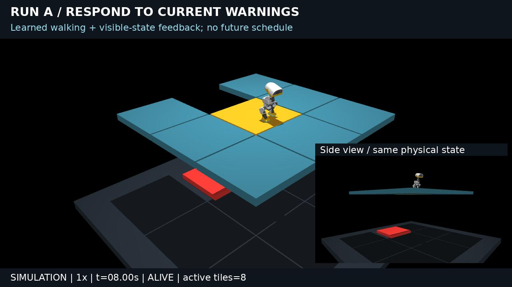
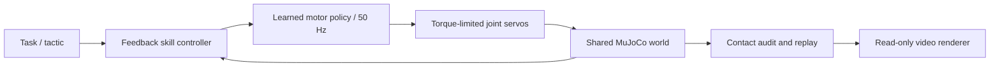

# ROSClaw × Microduck — Duckverse

**English** | [简体中文](README.zh-CN.md)

A series of reproducible robot games in **MuJoCo simulation**: contact-aware rope skipping, cooperative double jumping, reactive pursuit, and physical skill composition. Built with Pollen Robotics’ Microduck assets, learned ONNX motor policies, explicit controllers and contact audits. This repository contains code, weights, methods, failed experiments and replay evidence. Hardware deployment, Duckverse ROSClaw chat integration and autonomous evolution are not demonstrated.

## Delivered demos

Click each preview to watch or download its video. Cuts of one demo are grouped together; old versions are archived below.

### Cooperative Rope Skipping

[](out/microduck_youtube_en.mp4)

Two ducks rotate a mouth-held flexible rope; a third jumps. Learned motor policies use measured phase feedback. Contact-based evaluation: **442/516 clean cycles (85.7%), 5/8 runs pass**. Rope–turner and rope self-collisions are excluded.

[20 s continuous](out/microduck_studio_full.mp4) · [Slow-motion details](out/microduck_closeups.mp4) · [Methods, training & reproduction](docs/COOPERATIVE_ROPE_SKIPPING.md)

### Four-Duck Circus

[](https://github.com/ros-claw/microduck/releases/download/circus-pov-2026-09-17/microduck_circus_pov_en.mp4)

Two turners and two simultaneous jumpers share one world. Matching rope length and formation yields **258/260 shared clean cycles across four static runs**. The 108 s English film includes head-follow views and a failed moving entry. Impact penetration reaches **23–37 mm**; relay entry remains unsuccessful.

[Full static rollout](out/circus_matched_duo.mp4) · [Methods & reproduction](docs/CIRCUS_GEOMETRY_AND_TIMING.md) · [Contact limitations](docs/PHYSICAL_FIDELITY_AUDIT.md)

### Reactive Chase

[](https://github.com/ros-claw/microduck/releases/download/neon-escape-reactive-2026-09-28/microduck_neon_escape_v3_reactive_hero.mp4)

Live Jev selects tactics; learned policies execute movement and model-based previews compare routes. Six frozen runs: **5/6 escapes, 3/6 strict passes**. Routes use simulator state; this is not onboard vision.

[Technical video](https://github.com/ros-claw/microduck/releases/download/neon-escape-reactive-2026-09-28/microduck_neon_escape_v3_reactive_technical.mp4) · [Methods & reproduction](docs/REACTIVE_CHASE.md)

### Strike & Escape — final contact-detail edition

[](https://github.com/ros-claw/microduck/releases/download/neon-escape-contact-details-v6/microduck_neon_escape_v6_details_en.mp4)

Six encounters combine rolls, a real gap, rotating-arm contact and duck–ball–pin interactions that unlock the exit. The **63 s English final cut** replays valuable details in slow motion; a 5 kHz freeze shows the actual rod brush. Its selected 35.14 s simulation replays exactly; conservative capsule/box collisions are not visual-triangle collisions. Jev decisions come from the archived live run, with a new learned finish suffix; no new success-rate claim.

[35 s action cut](https://github.com/ros-claw/microduck/releases/download/neon-escape-strike-2026-09-30/microduck_neon_escape_v4_strike_hero.mp4) · [Final method & reproduction](docs/CONTACT_DETAILS.md) · [Evidence bundle](https://github.com/ros-claw/microduck/releases/download/neon-escape-contact-details-v6/microduck_neon_escape_v6_evidence.tar.gz)

## In development: Last Duck Standing

[](https://github.com/ros-claw/microduck/releases/download/duckverse-dg02-schedule-2026-10-08/duckverse_dg02_en.mp4)

**DG-02:** one duck, 3×3 real free-body tiles, seeded warnings/releases and a contact-based elimination referee. Ten paired development seeds: warning response stays alive to 14 s in 10/10; HOLD is eliminated in 10/10. All 20 input/decision/contact replays match exactly. A full nine-tile collapse ends in real failure, with no fabricated winner. This is not yet a multiplayer tournament. [Current method and reproduction](docs/duckverse/DG02_SCHEDULE_REFEREE.md) · [First physical calibration](docs/duckverse/LAST_DUCK_STANDING.md) · [Stage board](docs/duckverse/03-implementation-board.md) · [Series roadmap](docs/duckverse/game-content-roadmap.md).

## How it works

1. **Motor skills:** 61D observations feed 14D learned motor actions at 50 Hz; rope turners use a separate extended contract. Joint servos have explicit torque limits.
2. **Coordination and tactics:** deterministic feedback supplies goals and phase timing. Some Neon Escape runs use live Jev for finite skill choices and physical previews for transitions; these are separate from motor-policy inference.
3. **Physics:** robots and props share one MuJoCo world. Contacts, equality forces, gravity and actuation determine outcomes. Collision profiles and exclusions are disclosed per demo.
4. **Evidence and filming:** full-rate contact checks, recorded inputs and trajectory replay verify selected results. Cameras, slow motion and synthesized Foley are presentation only.


```mermaid
flowchart LR
    Goal[Task / tactic] --> Skill[Feedback skill controller]
    Skill --> Policy[Learned motor policy / 50 Hz]
    Policy --> Motor[Torque-limited joint servos]
    Motor --> World[Shared MuJoCo world]
    World --> Skill
    World --> Audit[Contact audit and replay]
    Audit --> Video[Read-only video renderer]
```

## Run locally

Validated: Linux, Python 3.13, MuJoCo 3.12. Policy inference runs on CPU; EGL accelerates video rendering.

```bash
git clone https://github.com/ros-claw/microduck.git
cd microduck
git checkout duckverse-dg02-schedule-2026-10-08
python3 -m venv .venv
.venv/bin/python -m pip install -e ".[dev]"
export MICRODUCK_ROOT="$PWD/.assets"
.venv/bin/python scripts/bootstrap.py

# Cooperative skipping
scripts/contact_skip.sh

# DG-02 warning response and contact referee; output must be new
OPENBLAS_NUM_THREADS=1 .venv/bin/python scripts/run_tile_survival.py \
  --seed 11 --duration 14 --out artifacts/duckverse-dg02/local-seed11

# DG-01 physical tile calibration
OPENBLAS_NUM_THREADS=1 .venv/bin/python scripts/run_last_duck_standing.py \
  --seed 11 --dt .0005 --out artifacts/duckverse/local-seed11

.venv/bin/python -m pytest tests -q
```

For each game’s exact command, policy and asset requirements, follow its method link above. [Pinned upstream assets](upstream.lock.yaml) · [Training source and exports](training/README.md). Model/trajectory binaries and larger movies are distributed as release assets.

## Earlier editions

| Edition | Video / method | Status |
| --- | --- | --- |
| Neon Escape V1 | [English film](https://github.com/ros-claw/microduck/releases/download/neon-escape-2026-09-26/microduck_neon_escape_en.mp4) · [Method](docs/NEON_ESCAPE.md) | Frozen first game |
| Neon Escape V2 | [Physical baseline](https://github.com/ros-claw/microduck/releases/download/neon-escape-v2-physical-baseline-2026-09-27/microduck_neon_escape_v2_physical_baseline_hero.mp4) · [Method](docs/NEON_ESCAPE_V2.md) | Rule-controlled baseline |
| Strike & Escape V4 | [Technical cut](https://github.com/ros-claw/microduck/releases/download/neon-escape-strike-2026-09-30/microduck_neon_escape_v4_strike_technical.mp4) · [Method](docs/STRIKE_ESCAPE.md) | Earlier skill composition |
| Victory finish V5 | [Release](https://github.com/ros-claw/microduck/releases/tag/neon-escape-victory-2026-10-03) | Superseded by V6 after motion review |
| Circus long details | [3:20 technical film](https://github.com/ros-claw/microduck/releases/download/circus-details-2026-09-17/microduck_circus_details_en.mp4) | Longer companion to 1:48 final cut |

## Code and evidence

| Path | Purpose |
| --- | --- |
| [`src/microduck_lab/sim`](src/microduck_lab/sim) | Robot runtime, composition and rope physics |
| [`src/microduck_lab/parkour`](src/microduck_lab/parkour) | Physical skill combinations and props |
| [`src/microduck_lab/arena`](src/microduck_lab/arena) | Independent Duckverse tile prototype |
| [`scripts`](scripts) | Run, evaluate, replay and render |
| [`policies`](policies) / [`training`](training) | Exported policies and training source |
| [`artifacts`](artifacts) / [`docs`](docs/README.md) | Results, failures, manifests and methods |

## Contributing and attribution

Include reproducible commands, seed/model hashes, contact evidence and limitations with behavior changes; preserve frozen references. Project code is Apache-2.0. Robot assets and upstream policies come from **Pollen Robotics**; upstream 3D models have their separate CC BY-SA-NC terms. See [LICENSE](LICENSE), [THIRD_PARTY](THIRD_PARTY.md), and [upstream lock](upstream.lock.yaml). ROSClaw/Jev integrations are credited only where actually exercised; Duckverse native-agent wiring is future work.
