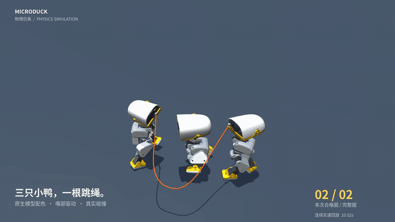
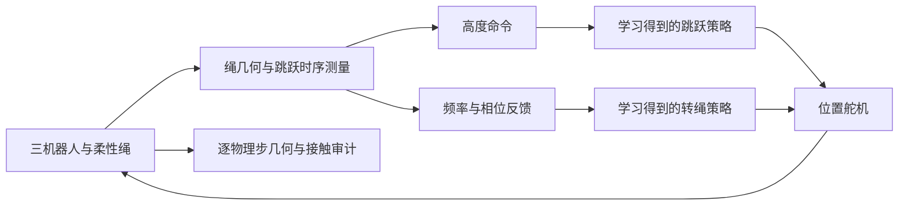
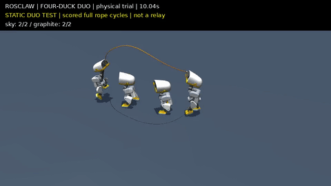

# MicroDuck：MuJoCo 中的多机器人协作跳绳

[English](README.md) | **简体中文**

MicroDuck 是一个研究接触条件下双足运动与多机器人协调的仿真项目。两只 Microduck 机器人通过嘴部把手驱动柔性绳，第三只机器人学习跳过绳子。系统结合强化学习运动策略、显式相位反馈，以及基于几何与接触的评估器。

项目的核心问题是：**在真实物理接触条件下，让转绳、双脚净空和稳定落地同时成立。** 仅在正确时刻起跳并不够；绳子必须实际经过双脚下方，机器人必须干净落地，绳端也必须保持与转绳机器人的连接。

本仓库提供部署运行时、导出策略、评估证据、渲染工具，以及可还原训练实现的源码补丁。当前成果是 **MuJoCo 物理仿真**，尚未演示真实硬件部署，也不是端到端多智能体强化学习系统。

[方法](#方法) · [评估](#评估) · [快速开始](#快速开始) · [训练](#训练) · [仓库结构](#仓库结构)

## 演示

[全英文演示：方法、特写与结果](out/microduck_youtube_en.mp4) · [英文视频说明](docs/YOUTUBE_EN.md)

[](out/microduck_studio_full.mp4)

[连续 20 秒完整回放](out/microduck_studio_full.mp4) · [嘴部连接与脚下净空特写](out/microduck_closeups.mp4) · [竖版演示](out/microduck_social.mp4)

完整回放包含启动阶段。特写以 0.25× 速度重放同一段轨迹，不代表额外独立测试。渲染使用模型原生材质，外观调整前后的逐圈判定记录已核对一致。参见 [轨迹审计](artifacts/presentation/audit.json) 与 [渲染元数据](artifacts/presentation/manifest.json)。

## 方法

### 1. 共享物理环境

三份官方 Microduck 模型与一条分段柔性绳位于同一个 MuJoCo 世界中。绳端通过等式约束连接嘴部把手，球关节允许绳段弯曲与扭转。当前配置从初始化开始启用绳—跳跃鸭和绳—地面碰撞；绳—甩绳鸭碰撞被明确排除，绳端仍通过嘴部把手约束传力，不使用 mocap 载具驱动绳子，也不钳制绳关节速度。

| 组成 | 当前配置 |
| --- | --- |
| 机器人驱动 | 每只机器人 14 个位置控制舵机 |
| 策略执行 | 50 Hz，ONNX Runtime |
| 物理积分 | 0.2 ms 步长，Euler 积分，Newton 求解器 |
| 柔性绳 | 长度 0.58 m，碰撞半径 1.5 mm，球关节链 |
| 协调机制 | 实测绳相位与跳跃时序反馈，转绳频率上限 3.1 Hz |

实现入口：[世界构建](src/microduck_lab/sim/classic_rope.py)、[策略运行时](src/microduck_lab/sim/runtime.py)、[最终配置](scripts/contact_skip.sh)。

### 2. 运动策略训练

转绳和跳跃策略在基于 mjlab 的上游训练框架中分别使用 PPO 训练，再导出包含观测归一化的 ONNX 模型。

- **转绳端：** 带绳训练策略学习在承受绳子反作用力时保持平衡并移动嘴部把手。部署时运行两个策略实例，由协调器提供相位指令。转绳策略使用 73 维观测。
- **跳跃端：** 先学习原地跳跃和稳定支撑落地，再引入有物理碰撞、受力矩限制的旋转障碍。接触惩罚与落地记忆阻止擦到障碍的跳跃获得干净落地奖励。该障碍是**训练装置**，不等于最终柔性绳场景。
- **部署接口：** 跳跃策略保持 61 维观测布局，在既有身体高度命令中传入随绳相位变化的目标。导出元数据 `hop_height_command=sweep-v1` 标记该命令语义。

当前权重为 [`ropehop_contact.onnx`](policies/ropehop_contact.onnx) 和 [`turner_rope.onnx`](policies/turner_rope.onnx)。[训练源码包](training/README.md) 包含环境定义、奖励、导出修改与回归测试。

### 3. 闭环协调

部署时，根据柔性绳中间材料段相对双脚和把手轴的位置计算绳相位，在绳子即将从下方经过时提高跳跃高度目标。该目标交给学习策略执行，不直接修改机器人位置。

转绳端根据实测起跳间隔调整频率，再通过相位反馈环，根据绳子经过与跳跃顶点的时间差调整共享节拍。3.1 Hz 上限有助于保留落地支撑时间。这些测量来自**仿真状态**，尚未实现摄像头或机载感知。



学习策略产生运动动作，协调器提供时序反馈，评估器判断完整跳绳是否物理有效。训练奖励和旧版时序命中计数均不作为最终成功率。

## 评估

### 怎样才算成功跳过一圈？

[评估器](src/microduck_lab/sim/skip_metrics.py) 检查每一个物理步。启动窗口结束后的完整转绳圈作为计分机会，合格圈必须满足：

- 绳子经过头顶，并实际经过双脚下方；每只脚的脚底净空至少 **1 mm**，双脚穿越时间差不超过 120 ms。
- 整圈没有绳—跳跃者接触，也没有跳跃者非脚部位触地。
- 绳子经过双脚后，完成直立、无碰撞落地，并维持至少 **50 ms 连续脚部支撑**。
- 三只机器人保持直立，嘴部连接误差不超过 **10 mm**，绳—地面数值穿透不超过 **2 mm**。

单次运行只有在前 9 秒内完成起旋、启动后至少计入 20 圈且合格率达到 80% 时才通过。四鸭后续复核发现，碰绳时存在 **23–37 mm 的明显穿入**，不能仅解释为微小数值误差；绳—甩绳鸭和绳自碰撞被关闭。详见[物理真实性复核](docs/PHYSICAL_FIDELITY_AUDIT.md)。

### 实测结果

8 次运行各持续 30 秒，种子控制初始舵机姿态的 ±0.02 rad 扰动。每次运行前 9 秒不纳入逐圈评分。

| 种子 | 合格圈 / 完整圈 | 合格率 |
| --- | ---: | ---: |
| 0 | 65 / 65 | 100% |
| 1 | 65 / 65 | 100% |
| 2 | 65 / 65 | 100% |
| 3 | 43 / 63 | 68.3% |
| 101 | 65 / 65 | 100% |
| 202 | 37 / 64 | 57.8% |
| 303 | 65 / 65 | 100% |
| 404 | 37 / 64 | 57.8% |
| **合计** | **442 / 516** | **85.7%** |

**8 次运行中，5 次单独通过。** 合计超过 80%，但仍有 3 次未达到要求。种子 101、202、303、404 在转绳频率上限确定后评估，不能将全部 8 个种子称为独立留出测试。20 秒演示另外得到启动后 33/33 的结果，不能替代批次成绩。

证据：[机器可读批次结果](artifacts/takeover/contact-summary.json)、[训练与消融记录](docs/SWEEP_TRAINING.md)。早期“93%”对应时序命中或不同任务，不是当前真实接触配置的结果。

## 快速开始

已验证环境：**Linux、Python 3.13、MuJoCo 3.12**。策略评估可在 CPU 上运行，NVIDIA EGL 可加速渲染。使用交付策略无需重新训练。

```bash
git clone https://github.com/ros-claw/microduck.git
cd microduck
python3 -m venv .venv
.venv/bin/python -m pip install -e '.[dev]'

# 后续命令保持此环境变量
export MICRODUCK_ROOT="$PWD/.assets"
.venv/bin/python scripts/bootstrap.py

# 默认 seed 0，30 秒，不渲染，逐物理步评估
scripts/contact_skip.sh

# 回归测试
.venv/bin/python -m pytest tests -q
```

初始化按 [`upstream.lock.yaml`](upstream.lock.yaml) 获取固定提交的官方资产。已有资产仓库会保留当前版本，不自动切换；自行提供的版本需与固定模型兼容。评估输出 `artifacts/takeover/contact-latest.json`，包含判定标准及逐圈失败原因。

复现全部 8 个种子的评估，并将输出与仓库已有证据分开保存：

```bash
mkdir -p artifacts/local
for seed in 0 1 2 3 101 202 303 404; do
  OPENBLAS_NUM_THREADS=1 scripts/contact_skip.sh --seed "$seed" \
    --output "artifacts/local/seed-${seed}.json"
done
```

### 渲染轨迹

渲染需要 EGL/OpenGL 驱动和 Noto Sans CJK 字体（Ubuntu 包名 `fonts-noto-cjk`）。

```bash
MUJOCO_GL=egl PYOPENGL_PLATFORM=egl OPENBLAS_NUM_THREADS=1 \
  .venv/bin/python scripts/publish_contact_video.py --capture

MUJOCO_GL=egl PYOPENGL_PLATFORM=egl OPENBLAS_NUM_THREADS=1 \
  .venv/bin/python scripts/render_closeups.py
```

第一条命令以 200 Hz 捕获状态，核对逐圈记录与已有参考一致后渲染；第二条复用轨迹生成特写。四分之一速回放输出 50 fps，不插值关节。无 EGL 时可同时将两个 GL 环境变量设为 `osmesa`，需要系统 OSMesa 库且渲染较慢。大型本地轨迹和模型缓存已由 Git 忽略。竖版演示声音为后期拟音，不是仿真录音。

## 训练

部署仓库与上游训练框架分离。[`training/microduck_rl.patch`](training/microduck_rl.patch) 可从固定上游基线还原训练源码提交 `18052aaf7d98942921a8d57319f40d3692f96bcd`，已验证还原后的 Git 文件树与该提交一致。

```bash
# 在本仓库根目录执行，使用新的训练目录
DELIVERY_ROOT="$PWD"
git clone https://github.com/pollen-robotics/microduck_rl.git ../microduck-training
cd ../microduck-training
git checkout -b microduck-contact 5946fd9cdbc58956424420153e51975af3b30d77
git apply --check "$DELIVERY_ROOT/training/microduck_rl.patch"
git apply "$DELIVERY_ROOT/training/microduck_rl.patch"
uv sync
uv run --with pytest pytest tests/test_clean_ropehop_cfg.py tests/test_sweep_ropehop_cfg.py
```

接触训练任务为 `Mjlab-SweepRopeHop-Flat-MicroDuck`。遵循训练仓库说明，长时间 GPU 训练前先执行 64 环境、5 iteration 的 smoke 测试。[训练记录](docs/SWEEP_TRAINING.md) 说明了课程、环境原点偏移修复与消融实验。

**仓库不包含原始 `.pt` 检查点或完整训练日志。** 实验记录中的 resume 命令需要对应检查点。源码包支持从头训练，但不保证重现交付权重或相同成绩。评估已有 ONNX 策略不依赖这些检查点。

## 仓库结构

| 路径 | 职责 |
| --- | --- |
| `src/microduck_lab/sim/classic_rope.py` | 共享世界、柔性绳构建、连接与接触 |
| `src/microduck_lab/sim/runtime.py` | ONNX 推理、观测契约与舵机命令 |
| `src/microduck_lab/sim/skip_metrics.py` | 物理逐圈评分与失败分类 |
| `src/microduck_lab/demos/honest_skip.py` | 三机器人回放与反馈协调 |
| `scripts/contact_skip.sh` | 参考评估配置 |
| `scripts/publish_contact_video.py`、`scripts/render_closeups.py` | 轨迹核验、捕获与渲染 |
| `policies/` | 导出部署策略，包含历史版本 |
| `training/` | 训练源码补丁与恢复说明 |
| `tests/` | 部署与评估器回归测试 |
| `artifacts/takeover/`、`artifacts/presentation/` | 评估记录、轨迹及视频来源信息 |
| `docs/`、`out/` | 技术记录与演示素材 |

[文档索引](docs/README.md) 区分当前证据与历史实验。仓库保留了早期 ROSClaw 练习和演化原型，但它们不是本文所述参考方法，也不是当前验收依据。

## 实验阶段：Circus Director

第一阶段原型新增 Graphite、5 / 3 / 5 接力状态机、逐跳跃者接触审计和由证据控制晋级的加速课程。**完整接力、无碰撞入绳和加速 30% 尚未通过。** 当前使用有界中英文语法解析任务，Practice 搜索控制参数，尚不自动重训 PPO。

[实现与命令](docs/CIRCUS_DIRECTOR.md) · [实测结果与失败分析](docs/CIRCUS_RESULTS_2026-09-17.md) · [机器可读证据](artifacts/circus/summary.json)

后续空间对照中，匹配绳长与宽队形后，原地双跳在四组独立 30 秒验证中达到 **258/260 个共同合格圈，四组全部通过**；每组均排除前 9 秒启动窗口。移动入场仍因碰绳未通过。[碰撞与节奏分析（保留失败配置）](docs/CIRCUS_GEOMETRY_AND_TIMING.md) · [完整双跳录像](out/circus_matched_duo.mp4)。

**新增：[1 分 48 秒头部跟随视角与慢动作短片](docs/CIRCUS_POV_VIDEO.md)。** [物理真实性复核](docs/PHYSICAL_FIDELITY_AUDIT.md)明确记录了碰绳时的明显穿入，以及绳—甩绳鸭碰撞被排除的限制。

[3 分 20 秒慢动作细节版：嘴部连接、双鸭脚下过绳、队形与入场失败特写](https://github.com/ros-claw/microduck/releases/download/circus-details-2026-09-17/microduck_circus_details_en.mp4) · [视频说明及中文字幕](docs/CIRCUS_DETAILS_VIDEO.md)

[](out/circus_matched_duo.mp4)

## 局限与后续方向

- **起旋与扰动鲁棒性：** 3 个已评估种子仍低于目标。擦绳、净空不足和落地支撑过短仍是失败原因。
- **显式协调：** 当前依赖仿真状态反馈与共享时序控制器。分布式感知和完全学习得到的多智能体协调仍待实现。
- **训练与部署差异：** 跳跃训练的旋转障碍比部署柔性绳简单，必须保留完整三机器人场景验证。
- **恢复与硬件迁移：** 尚未验证失败跳跃后的可靠恢复，也未演示真实机器人运行。

## 参与贡献

报告问题时请提供提交版本、依赖版本、种子、完整命令和评估 JSON；视觉问题可附视频。修改控制或物理配置后，请运行回归测试，并在参考配置下比较完整种子评估结果。报告合计成绩时同时提供失败种子与启动行为，不要用时序命中计数或训练奖励替代物理评估。

## 许可与致谢

本仓库代码采用 [Apache-2.0](LICENSE)。机器人模型和原生材质来自 [Pollen Robotics Microduck](https://github.com/pollen-robotics/microduck) 及其 [训练仓库](https://github.com/pollen-robotics/microduck_rl)，资产许可和固定来源记录于 [`upstream.lock.yaml`](upstream.lock.yaml)。上游模型单独获取，不因本项目代码许可而重新授权。官方运行时策略、原 ROSClaw 原型与 quackd 参考实现为项目提供了基础与参考。
