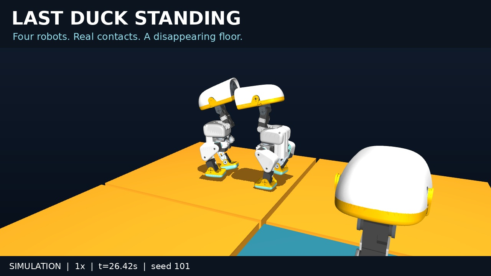
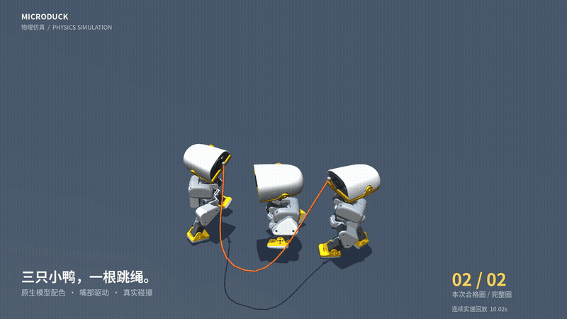
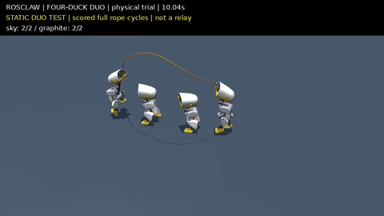
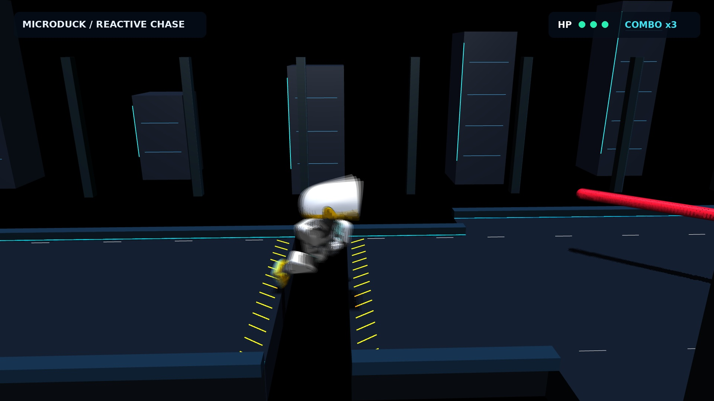
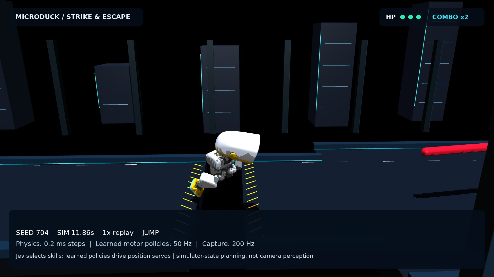
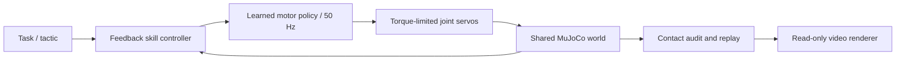

# ROSClaw × Microduck — 小鸭物理宇宙

[English](README.md) | **简体中文**

一系列可复现的 **MuJoCo 机器人仿真游戏**：真实接触跳绳、双鸭协作、动态追逐与组合技能闯关。复用 Pollen Robotics 的 Microduck 资产、ONNX 学习运动策略、显式控制器和接触审计，提供代码、权重、方法、失败实验及回放证据。Duckverse 已通过候选仿真 Kit 接通真实 ROSClaw chat；尚未验证真机部署或自主进化。

## 已交付 Demo

点击预览观看或下载视频。同一 Demo 的不同剪辑放在一起，旧版本单独归档。

### 最后一块地板 · 四鸭同场淘汰赛

[](https://github.com/ros-claw/microduck/releases/download/duckverse-game-2026-10-08-r1/duckverse_game_en.mp4)

四只独立控制的 Microduck 根据当前可见预警，在不断塌陷的场地中换格避险。学习步态驱动受限力矩关节，地板解除约束后受重力真实下坠；裁判要求最后一只鸭仍直立且有真实承重支撑。**四种布局、两种节奏，不读取未来安排，不预设冠军。**

[46 秒英文特写与慢动作](https://github.com/ros-claw/microduck/releases/download/duckverse-game-2026-10-08-r1/duckverse_game_en.mp4) · [17 秒竖屏](https://github.com/ros-claw/microduck/releases/download/duckverse-game-2026-10-08-r1/duckverse_game_short_en.mp4) · [2:24 方法与鸭子视角](https://github.com/ros-claw/microduck/releases/download/duckverse-game-2026-10-08-r1/duckverse_game_technical_en.mp4) · [35 秒连续原始视角](https://github.com/ros-claw/microduck/releases/download/duckverse-game-2026-10-08-r1/duckverse_game_reference.mp4)

物理质量：**双鸭 10/10、四鸭 12/12、新 heldout 32/32** 通过声明的接触阈值。32 局结果为 **12 局产生冠军、20 局平局**，不是“100% 游戏成功”。最大审计接触穿透 **1.798 mm**；头部、躯干采用保守碰撞包围盒，不是逐渲染三角形碰撞。四鸭仿真平均 **0.669×**，完整证据录制采用离线方式。

真实 `rosclaw chat` 使用 **GPT-6 Astra / medium**，经原生动作通道取得已消费授权和终态执行回执。模型负责开赛与检查结果，具体战术、关节运动分别由确定性控制器和现有 ONNX 策略执行。需要尚未合并的 [ROSClaw 候选 PR #632](https://github.com/ros-claw/rosclaw/pull/632)。

[方法、局限与复现](docs/duckverse/GAME.zh-CN.md) · [完整评测](artifacts/duckverse-game/qa-summary.json) · [原生动作与 Practice lineage](docs/duckverse/ROSCLAW_INTEGRATION.md) · [视频、字幕与证据](docs/duckverse/PUBLICATION.md)

### 三鸭协作跳绳

[](out/microduck_youtube_en.mp4)

两鸭用嘴衔手柄带动柔性绳，第三只鸭跳过；学习策略结合实测相位反馈。接触验收为 **442/516 个干净周期（85.7%），5/8 次运行通过**；关闭绳与甩绳鸭、绳自碰撞。

[20 秒连续录像](out/microduck_studio_full.mp4) · [慢动作特写](out/microduck_closeups.mp4) · [方法、训练与复现](docs/COOPERATIVE_ROPE_SKIPPING.zh-CN.md)

### 四鸭双跳马戏团

[](https://github.com/ros-claw/microduck/releases/download/circus-pov-2026-09-17/microduck_circus_pov_en.mp4)

两鸭甩绳、两鸭同时跳，处于同一个物理世界。匹配绳长与站位后，四次原地双跳共 **258/260 个干净周期**。108 秒英文版包含跟随视角及入场失败；碰撞时穿入达 **23–37 毫米**，尚未完成动态接力。

[完整原地双跳](out/circus_matched_duo.mp4) · [方法与复现](docs/CIRCUS_GEOMETRY_AND_TIMING.md) · [接触局限](docs/PHYSICAL_FIDELITY_AUDIT.md)

### 动态追逐与路线选择

[](https://github.com/ros-claw/microduck/releases/download/neon-escape-reactive-2026-09-28/microduck_neon_escape_v3_reactive_hero.mp4)

真实 Jev 调用选择战术，学习策略执行动作，物理预演比较路线。六次冻结实验 **5/6 逃脱、3/6 严格通过**；使用仿真状态，不代表机载视觉。

[技术视频](https://github.com/ros-claw/microduck/releases/download/neon-escape-reactive-2026-09-28/microduck_neon_escape_v3_reactive_technical.mp4) · [方法与复现](docs/REACTIVE_CHASE.md)

### 撞瓶开门闯关 · 最终接触细节版

[](https://github.com/ros-claw/microduck/releases/download/neon-escape-contact-details-v6/microduck_neon_escape_v6_details_en.mp4)

六个关卡组合翻滚、真实跨坑、旋转杆接触和鸭—球—瓶联动开门。**63 秒最终英文版**用慢动作突出关键物理交互，5 kHz 接触帧展示真实擦杆。选定的 35.14 秒仿真可精确重放；胶囊/包围盒碰撞并非逐三角形碰撞。沿用历史真实 Jev 决策，接续新学习收尾策略，不新增成功率宣称。

[35 秒动作版](https://github.com/ros-claw/microduck/releases/download/neon-escape-strike-2026-09-30/microduck_neon_escape_v4_strike_hero.mp4) · [最终方法与复现](docs/CONTACT_DETAILS.md) · [证据包](https://github.com/ros-claw/microduck/releases/download/neon-escape-contact-details-v6/microduck_neon_escape_v6_evidence.tar.gz)

## 方法

1. **运动技能**：61 维观测输入学习策略，以 50 Hz 输出 14 维电机动作；甩绳策略使用独立扩展接口。关节伺服有明确力矩限制。
2. **协调与战术**：确定性反馈提供目标和相位时序；部分闯关实验用真实 Jev 调用选择有限技能，以物理预演比较衔接，与运动策略推理分层。
3. **物理交互**：机器人与道具处于同一 MuJoCo 世界，接触、约束力、重力和关节驱动决定结果，各 Demo 单独披露碰撞模型及排除项。
4. **证据与拍摄**：逐物理步接触检查、输入记录及轨迹重放核验结果；镜头、慢动作和合成音效只用于呈现。


```mermaid
flowchart LR
    Goal[Task / tactic] --> Skill[Feedback skill controller]
    Skill --> Policy[Learned motor policy / 50 Hz]
    Policy --> Motor[Torque-limited joint servos]
    Motor --> World[Shared MuJoCo world]
    World --> Skill
    World --> Audit[Contact audit and replay]
    Audit --> Video[Read-only video renderer]
```

## 本地运行

已验证 Linux、Python 3.13、MuJoCo 3.12。策略在 CPU 推理，视频可使用 EGL 渲染。

```bash
git clone https://github.com/ros-claw/microduck.git
cd microduck
git checkout duckverse-game-2026-10-08-r1
python3 -m venv .venv
.venv/bin/python -m pip install "mujoco==3.12.0" -e ".[dev,rosclaw]"
export MICRODUCK_ROOT="$PWD/.assets"
.venv/bin/python scripts/bootstrap.py

# Cooperative skipping
OPENBLAS_NUM_THREADS=1 .venv/bin/python scripts/run_duckverse.py \
  --seed 101 --players 4 --layout square --cadence steady \
  --out artifacts/duckverse-game/local-seed101

scripts/contact_skip.sh

# DG-02 warning response and contact referee; output must be new
OPENBLAS_NUM_THREADS=1 .venv/bin/python scripts/run_tile_survival.py \
  --seed 11 --duration 14 --out artifacts/duckverse-dg02/local-seed11

# DG-01 physical tile calibration
OPENBLAS_NUM_THREADS=1 .venv/bin/python scripts/run_last_duck_standing.py \
  --seed 11 --dt .0005 --out artifacts/duckverse/local-seed11

.venv/bin/python -m pytest tests -q
```

各游戏的实际命令、策略和资产依赖见上方方法链接。[锁定上游版本](upstream.lock.yaml) · [训练源码与导出](training/README.md)。大型模型、轨迹与视频通过 Release 分发。

## 历史版本

| Edition | Video / method | Status |
| --- | --- | --- |
| Neon Escape V1 | [English film](https://github.com/ros-claw/microduck/releases/download/neon-escape-2026-09-26/microduck_neon_escape_en.mp4) · [Method](docs/NEON_ESCAPE.md) | Frozen first game |
| Neon Escape V2 | [Physical baseline](https://github.com/ros-claw/microduck/releases/download/neon-escape-v2-physical-baseline-2026-09-27/microduck_neon_escape_v2_physical_baseline_hero.mp4) · [Method](docs/NEON_ESCAPE_V2.md) | Rule-controlled baseline |
| Strike & Escape V4 | [Technical cut](https://github.com/ros-claw/microduck/releases/download/neon-escape-strike-2026-09-30/microduck_neon_escape_v4_strike_technical.mp4) · [Method](docs/STRIKE_ESCAPE.md) | Earlier skill composition |
| Victory finish V5 | [Release](https://github.com/ros-claw/microduck/releases/tag/neon-escape-victory-2026-10-03) | Superseded by V6 after motion review |
| Circus long details | [3:20 technical film](https://github.com/ros-claw/microduck/releases/download/circus-details-2026-09-17/microduck_circus_details_en.mp4) | Longer companion to 1:48 final cut |

## 代码与证据

| 路径 | 用途 |
| --- | --- |
| [`src/microduck_lab/sim`](src/microduck_lab/sim) | 机器人运行时、场景组合与绳物理 |
| [`src/microduck_lab/parkour`](src/microduck_lab/parkour) | 物理技能组合与道具 |
| [`src/microduck_lab/arena`](src/microduck_lab/arena) | 四鸭同场仿真、战术及裁判 |
| [`scripts`](scripts) | 运行、评测、重放和渲染 |
| [`policies`](policies) / [`training`](training) | 导出策略与训练源码 |
| [`artifacts`](artifacts) / [`docs`](docs/README.md) | 结果、失败、产物清单与方法 |

## 贡献与署名

行为变更请附复现命令、seed/模型哈希、接触证据和局限，并保留冻结参考。项目代码采用 Apache-2.0；机器人资产与上游策略来自 **Pollen Robotics**，上游 3D 模型另有 CC BY-SA-NC 条款。见 [LICENSE](LICENSE)、[THIRD_PARTY](THIRD_PARTY.md)、[上游锁定文件](upstream.lock.yaml)。ROSClaw/Jev 仅在实际调用过的实验中标注参与；Duckverse 原生 Agent 已用候选核心扩展实测；Practice 是事后导入的仿真记录，不代表在线学习。
