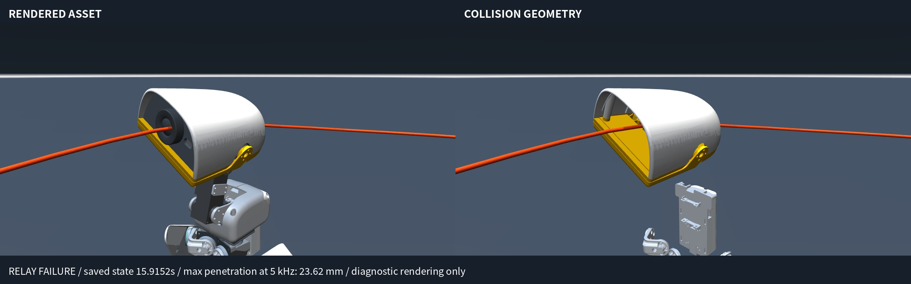

# Physical fidelity audit / 物理真实性复核

The contact model is **not penetration-free**. Enabled collision pairs and nonzero contact forces do not establish rigid, impermeable contact. This audit corrects the broader wording in both READMEs.

**结论：当前模型存在明显穿模。** 开启碰撞、测到接触力，不等于绳子不会穿入机器人。中英文 README 已将笼统的“绳—机器人碰撞开启”改为准确的碰撞范围。

## Measured results / 实测结果

The original film's 20-second static duo and 27-second relay were re-simulated with a read-only contact observer at every **0.2 ms physics step (5 kHz)**. Both reproduce the original per-jumper cycle records and relay verdict exactly. These are repeated source runs, not additional independent validation seeds.

| Source / 片段 | Pair / 接触对象 | Maximum penetration / 最大穿入 | Time / 仿真时间 |
| --- | --- | ---: | ---: |
| Static duo, startup / 原地双跳启动 | Rope–Graphite jaw / 绳—下颚 | 30.87 mm | 0.9528 s |
| Static duo, startup / 原地双跳启动 | Rope–Sky trunk / 绳—躯干 | 14.89 mm | 1.7062 s |
| Relay, startup / 接力启动 | Rope–Sky jaw / 绳—下颚 | 37.33 mm | 4.2912 s |
| Relay, moving entry / 接力入场 | Rope–Graphite jaw / 绳—下颚 | 23.62 mm | 15.9158 s |

The rope radius is only **1.5 mm**. These overlaps are much too large to describe as negligible numerical error. In the relay entry, first contact occurs at **15.5954 s**; its maximum normal contact force over the run is **0.291 N**. The solver generates a response, but permits substantial overlap. This attempt remains a failure.

绳半径只有 **1.5 毫米**，上述穿入不能解释成微小误差。入场鸭于 **15.5954 秒**首次碰绳，相关接触的最大法向力为 **0.291 牛顿**；有力学响应，但不足以阻止明显穿入，该入场仍判失败。

In the filmed static-duo run, all 33 evaluated shared cycles after the 9-second startup window are clean; startup contact failures are not included in that score. This does not make startup physically valid. The largest rope–floor penetration in that run is **1.616 mm**, below the existing 2 mm evaluator limit, but still nonzero. No MuJoCo warnings were recorded in the two reference reruns; absence of warnings does not establish physical accuracy.

原地双跳录像中，9 秒后评估的 33 个共同完整周期均合格；启动阶段的碰绳不计入该分数，但这绝不意味着启动过程没有物理问题。该段绳—地面最大穿入 **1.616 毫米**，虽然低于现有 2 毫米验收阈值，仍不是零穿透。两次复跑均未报告 MuJoCo 警告；没有警告也不等于物理准确。



The picture replays the nearest 200 Hz saved state; the numerical maxima above come from the independent 5 kHz live observer. The collision-only image is a diagnostic view, not a different simulation.

图中使用最近的 200 Hz 存档状态；上表最大值来自 5 kHz 实时物理步观察器。碰撞几何图仅用于诊断，没有改变原仿真。

## What the model does / 模型实际做了什么

- **Rope–jumpers and rope–floor:** enabled from initialization. Effective rope–duck contact `solref=[0.025,1]` and `solimp=[0.75,0.875,0.001,0.5,2]` were measured at peak penetration. These contacts are soft. MuJoCo explicitly permits penetration in its [soft contact formulation](https://mujoco.readthedocs.io/en/stable/computation/index.html#soft-contact-model); the present parameterization has not been calibrated against real materials.
- **Rope–turners:** explicitly excluded. Endpoint equality constraints still transmit force to mouth-held handles, but the rest of the rope can pass through turner bodies. Do not describe this as full rope–all-robot collision simulation.
- **Rope self-contact:** disabled by the collision masks. The articulated capsule chain is not validated for knots or self-collision.
- **Rendered assets versus collision geometry:** the jaw has decorative meshes with masks `0/0` and three collision meshes with masks `1/9`. The rendered surface is not an exact contact surface.
- **Actuation:** learned motor policies command servos. The filmed protocol has zero mocap bodies and disables rope-velocity clipping. Initial state placement and saved-state replay for rendering are separate from the live physics controller.
- **Observation:** coordination uses privileged simulation state, not demonstrated onboard camera perception. New head-follow cameras are for viewing only.
- **Limits:** this audit measures detected solver contacts. It does not prove that every possible fast crossing is detected, provide continuous collision detection, or validate contact/material behavior on hardware.

对应中文说明：跳跃鸭和地面参与碰撞；甩绳鸭不参与绳身碰撞，仅由嘴部端点约束传力；绳子也没有自碰撞。外观网格和碰撞网格不完全相同。机器人由策略控制舵机，拍摄协议没有 mocap 或绳速钳制，但协调器读取仿真真值。新增镜头不代表视觉控制。这次检查不能证明任意高速运动都不会漏碰，也不能替代实机材料标定。

## Reproduce / 复现

```bash
OPENBLAS_NUM_THREADS=1 MUJOCO_GL=egl .venv/bin/python scripts/audit_circus_contacts.py duo
OPENBLAS_NUM_THREADS=1 MUJOCO_GL=egl .venv/bin/python scripts/audit_circus_contacts.py relay
# Isolated stiffness experiments; these do not modify the production defaults:
OPENBLAS_NUM_THREADS=1 MUJOCO_GL=egl .venv/bin/python scripts/audit_circus_contacts.py duo --stiff
OPENBLAS_NUM_THREADS=1 MUJOCO_GL=egl .venv/bin/python scripts/audit_circus_contacts.py relay --stiff
```

Raw reports: [duo](../artifacts/physical-fidelity/duo.json), [relay](../artifacts/physical-fidelity/relay.json). Contact sample counts count contact records across physics steps, not distinct impact events. Integrated normal impulse sums all these records.

原始报告保留每对接触的最大穿深、最大法向力、累计法向冲量、接触参数和警告。接触样本数是逐步接触记录数，不是独立撞击次数。

## Stiffer-contact comparison / 更硬接触对照

An isolated comparison raises rope geometry priority to 1 and sets `solref=[0.002,1]`, `solimp=[0.95,0.99,0.001,0.5,2]`. Explicit rope–floor pairs retain their original settings. No policy, collision mask, geometry or endpoint exclusion is changed.

| Protocol | Largest rope–jumper penetration, original → stiffer | Task result, original → stiffer |
| --- | ---: | --- |
| 20 s static duo, seed 0 | 30.87 → 6.04 mm | Pass → Fail |
| 27 s relay, seed 0 | 37.33 → 6.22 mm | Fail → Fail |

更硬接触确实减少了穿入，但没有消除；而且原本通过的原地双跳不再通过。**这不是已经完成的物理修复，因此未替换默认配置，短片仍重放原有轨迹。** 下一步需要在更严格的接触模型下重新优化启动和控制策略，再做独立种子验证；不能沿用旧配置的成功率。

This is a two-protocol diagnostic comparison, not a new validated controller or a completed penetration fix. Production defaults and video source trajectories are unchanged. Re-tuning or training under stricter contact, followed by independent seed validation, is still required.

Reports: [static duo, stiffer](../artifacts/physical-fidelity/duo-stiff.json), [relay, stiffer](../artifacts/physical-fidelity/relay-stiff.json). The observer regression test checks penetration and force on a known overlapping pair and verifies it leaves the solver state unchanged; the complete repository suite passes **50 tests**.
