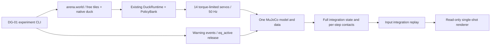

# DG-00 architecture / 架构

Current narrow dependency path:

Current code is a calibration experiment: one fixed neighbour target, fixed public warning times, two support releases. It does not contain a survival planner, winner, multiplayer or ROSClaw adapter. The controller reads current pose and issues motor-policy commands. Tile release changes equality activity only.

Future layers, introduced behind separate measured gates: schedule/referee → 2/4 duck assembly → public observation and baseline survivor → real ROSClaw SIMULATION app → optional Jev and Practice lineage → cinematic director. No empty modules for future capabilities are added. Existing single-duck Neon Escape world is not repurposed.

Native Agent is a task-level caller, not the motor controller. A future adapter must use current core descriptors/action boundaries, link real Body instances, task IDs and terminal receipts. DG-01 local run IDs are not ROSClaw mission IDs.
