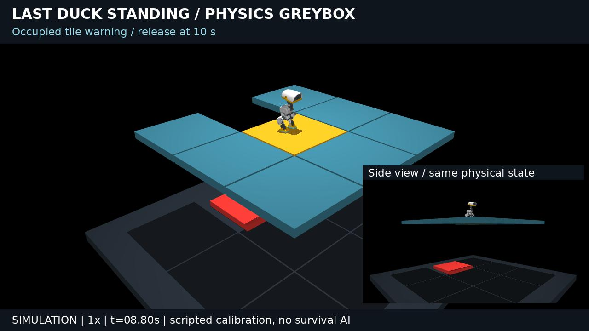

# Last Duck Standing: DG-01 / 最后一块地板：单鸭物理验证

**Status: DG-00 + DG-01 delivered, SIMULATION only.** This is a fixed calibration experiment, not a survival game, four-duck match, Jev run or ROSClaw live integration.

[12-second English greybox video](https://github.com/ros-claw/microduck/releases/download/duckverse-dg01-greybox-2026-10-08/duckverse_dg01_en.mp4) · [Full-rate evidence bundle](https://github.com/ros-claw/microduck/releases/download/duckverse-dg01-greybox-2026-10-08/duckverse_dg01_evidence.tar.gz) · [Battery](../../artifacts/duckverse/final/summary.json) · [Environment/assets](../../artifacts/duckverse/environment.json)

[](https://github.com/ros-claw/microduck/releases/download/duckverse-dg01-greybox-2026-10-08/duckverse_dg01_en.mp4)

## What actually happens

At t=0 the robot stands on tile 1. From 1–7 s, the existing walking policy receives current-position feedback toward adjacent tile 4. The original tile warns at 4 s and releases at 6 s, after the duck has crossed the 12 mm seam. The duck stands on tile 4, which warns at 8 s and releases at 10 s. The occupied tile and duck then physically fall onto the visible receiver. The experiment intentionally does not escape the second release: it tests loss of support and landing interaction.

The 12 s film is one continuous 1× replay. Two synchronized fixed views show the same states; the side inset makes the duck/platform fall visible underneath the remaining tiles. Colour is only a warning overlay. No audio, slow-motion interpolation, duck teleport, tile pose change or ghost support. Native asset materials are retained.

本轮按任务书先做单鸭灰盒：鸭子靠学习运动策略和当前位置反馈走到邻格；释放原格后仍能站住；随后有意解除脚下邻格约束，真实观察地板、鸭子下落及接收平台碰撞。不是比赛胜负，也不是“自主生存”。两个固定视角同步展示同一段物理轨迹。

## Measured acceptance

- **10/10 runs pass G1**, seeds 11–20, initial servo perturbation ±0.005 rad. These are development regressions, not heldout samples or game win rates.
- All ten reach supported neighbouring tile 4 before its warning, remain finite and report zero solver warnings or simulation-time resets. Locked tile displacement stays below **0.061 mm**.
- Maximum penetration across all recorded contact pairs and ten runs: **2.906 mm**. Maximum per-run P99: **0.0063 mm**. P99 includes many low-impact support contacts; the absolute maximum remains the relevant impact guardrail.
- Servo force remains ≤**0.6405 Nm**. No external applied robot force/torque. No collision plane in the arena; the only fixed load-bearing surface is the visible receiver 0.81 m below.
- Selected seed 11 stands about **46.7 mm** from neighbour centre at 7 s, then falls below arena height; its final root z is **-0.724 m**.
- All ten full-rate input replays are verified separately in per-run `replay.json`. Selected run: **24,000 physics steps**, zero qpos/qvel/contact error. Replay uses initial integration state + recorded motor inputs + equality activity, not per-frame robot placement.
- Recorded simulation performance: **3.67–4.20×** wall time, including JSON contact writing and full-state recording, excluding rendering. This is single-duck performance only; no four-duck real-time promise.

Measured standing native visual bounds: approximately **0.123 × 0.142 × 0.272 m**. Combined foot collision footprint: **0.054 × 0.125 m**. A 0.48 m tile leaves substantial one-duck margin. Turning-radius, two-duck passing and four-duck congestion remain untested.

## Timestep selection

Newton solver, 40 iterations; 50 Hz motor inference. Final tile weld `solref=[0.002,1]`, `solimp=[0.999,0.999,0.001,0.5,2]`; new-arena colliding geoms `solref=[0.001,1]`, `solimp=[0.99,0.99,0.001,0.5,2]`. Collision settings are confined to this builder; old worlds are unchanged. MuJoCo clamps positive time constants to at least twice dt, so coarser runs have effectively softer contact.

| Physics dt (ms) | Maximum penetration (mm), seed 11 | Recording speed |
| --- | ---: | ---: |
| 5 | 28.535 | 9.29× |
| 2 | 7.681 | 12.28× |
| 1 | 4.754 | 6.75× |
| 0.5 | 1.715 | 3.94× |

The **0.5 ms** configuration is the most economical tested step that meets the contact gate. 1 ms and coarser fail the ≤3 mm bound. The sweep is calibration evidence, not a universal guarantee for different impacts or multiple robots.

## Failed experiments retained

| Experiment | Actual failure / fix |
| --- | --- |
| `probe001` | Low command (0.18 m/s maximum) stalls; soft weld sags 5.53 mm; duck falls on original tile. Increase command authority, retain pose feedback |
| `probe002` | Direct stiff spring weld is unstable (QACC warning/reset), huge displacement; discarded |
| `probe003` / `calibration001` | Stable neighbour crossing, but 4 ms contact reference gives 5–7 mm impacts; 0/10 pass combined quality gate |
| `probe004` / `calibration002` | 1.2 ms contact profile: 9/10 pass; seed 14 receiver impact 3.111 mm exceeds 3 mm |
| `calibration003` / `final` | 1 ms contact profile at 0.5 ms integration: 10/10 pass; final includes explicit motor-force and reset audit |

[All experiment reports](../../artifacts/duckverse) remain in Git. Failed motor/physics runs were not substituted into the selected video.

## Reproduce

Install assets using the root README bootstrap instructions. Output directories must be new to protect existing evidence.

```bash
OPENBLAS_NUM_THREADS=1 .venv/bin/python scripts/run_last_duck_standing.py \
  --seed 11 --dt .0005 --out artifacts/duckverse/local-seed11

OPENBLAS_NUM_THREADS=1 .venv/bin/python scripts/replay_last_duck_standing.py \
  --run artifacts/duckverse/local-seed11

MUJOCO_GL=egl PYOPENGL_PLATFORM=egl OPENBLAS_NUM_THREADS=1 \
  .venv/bin/python scripts/render_last_duck_standing.py \
  --run artifacts/duckverse/local-seed11 --out out/duckverse_local.mp4

OPENBLAS_NUM_THREADS=1 .venv/bin/python scripts/eval_last_duck_standing.py \
  --out artifacts/duckverse/local-battery --dt .0005

OPENBLAS_NUM_THREADS=1 .venv/bin/python -m pytest tests -q
.venv/bin/python scripts/freeze_neon_v1.py
```

The evaluation script runs the four timestep comparisons followed by ten seeds. Reference validation: **90 passed, 0 failed, 0 skipped**; **51 V1 frozen files unchanged**. Standalone CLI deliberately exposes only current one-duck experiment options; future multiplayer/brain flags are not silently accepted.

The release evidence contains one shared compiled model, all ten trajectories, per-step contact streams, strict replay reports, source snapshot and asset/dependency digests. Shared model links avoid duplicating the identical 78 MB model. Full integration states retain equality activity and applied-force channels; contact lines identify force sample time. Video manifest binds the same selected source.

## Provenance and remaining limits

Pollen Microduck MJCF: `5946fd9cdbc58956424420153e51975af3b30d77`; XML SHA-256 `7a6fdf437f5a80c7348ad801f43f906b997a834389cb70cca5e1e8517ba38044`. Stand/walk policies from runtime `9f7eaad1008fffd90ef871a33a18aecd066b51a9`:

```json
{
  "stand": "1569268713e40deea795dd2922dba50d3621e15a872855408b6b1b125b1c094b",
  "walk": "e36332d383997d51401897734cd3e79cf5038406feddb18b4d57ecfb141daa6c"
}
```

Actual runtime **MuJoCo 3.12.0**, Python 3.13. Complete native asset digests and installed package versions: [environment.json](../../artifacts/duckverse/environment.json). Exact arena/runtime sources: [source archive](../../artifacts/duckverse/source.tar.gz); capture `source_sha256` fields bind motor/physics code independently of the later Git commit.

This gate covers one scripted path and two tile releases. There is no automatic winner/elimination referee, random fair release schedule, recovery/jump qualification, turning benchmark, survivor baseline, live Jev, ROSClaw Body instance or Practice/Darwin connection. No claim of exact visual-triangle collision or zero numerical penetration. The next safe milestone is **DG-02 schedule/referee**, then two-duck calibration; four-duck cinematic work waits for its gates.
