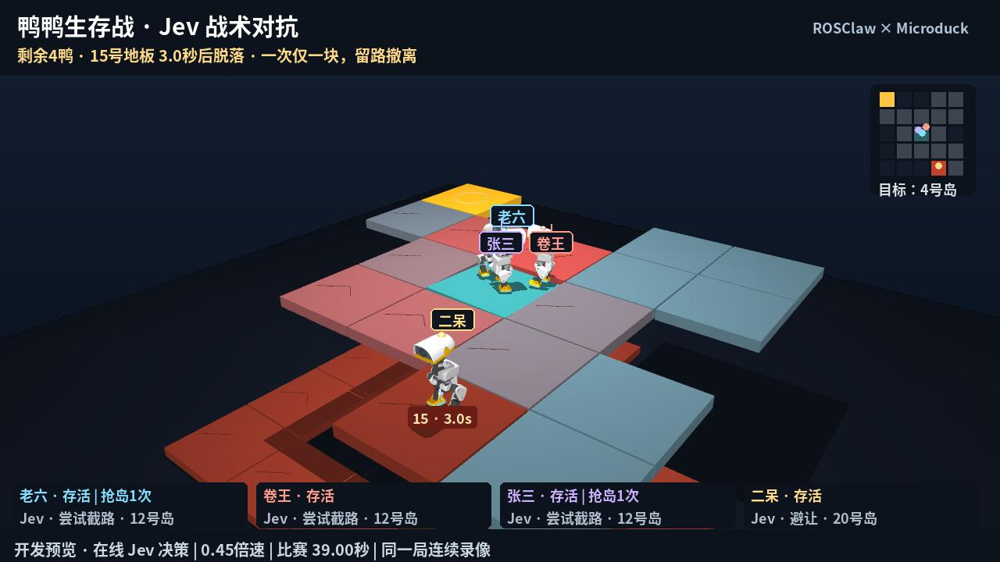

# Jev Duck Survival (unaccepted development)

[简体中文](README.zh-CN.md) · [Validation & limitations](VALIDATION.md) · [Evidence](../../artifacts/jev-rumble)

Four Microduck robots contest moving beacons and progressively disappearing floors in one MuJoCo world. **Live Jev selects tactical goals**; existing ONNX policies control the joints. This is separate from the archived [deterministic survival mode](../survival-rumble/README.md) and the confirmed skipping/parkour demos.

[](media/jev-survival-zh.mp4)

[Mandarin commentary, close-ups and slow motion · 110.88 s](media/jev-survival-zh.mp4). One chronological match ends with Lao Liu as its physical sole survivor. This is a development-branch review copy, not an accepted release.

## Architecture

Every two simulation seconds, one asynchronous HTTP request asks up to four typed choice questions, one per live character, with public poses, rivals' velocities, visible floor countdowns, reachable destinations and personality prompts. This is a shared batch, not four independent language-model agents. Jev chooses capture, interception, evasion, retreat or a short hold. The local route tracker executes that selected destination. Invalid distributions, expired responses and unreachable destinations are rejected. Confidence is reported without treating an uncalibrated cutoff as a safety certificate or silently discarding otherwise valid choices; absent valid plans, the duck brakes. Fallback is explicitly labelled.

Requests, raw responses, returned model IDs, token usage, wall-clock latency, simulation delivery times and acceptance decisions are recorded. Each applied 50 Hz motor decision cites its Jev request. Credentials come from `TYPESAFE_API_KEY` or `~/.config/microduck/typesafe.key` and are never logged. The typed contract uses the [official Jev API](https://docs.typesafe.ai/api).

Motor inference uses existing upstream 61D-to-14D ONNX walking/standing policies at 50 Hz, with ±0.6405 Nm joint torque limits and 4 kHz physics. No new motor policy was trained for this iteration. Full capture can run slower than wall time: API latency, physical response age and real-time factor are separate measurements.

## Recovery and gradual collapse

A local reflex interrupts pursuit when trunk up-cosine falls below 0.82 and runs the standing policy with zero velocity commands. Pursuit resumes only after up-cosine exceeds 0.94, real foot support exists and horizontal speed stays below 0.16 m/s for 0.18 s. An entry up-cosine below 0.3 selects an initial 0.8 s standing attempt; a moving fall gets 2 s to finish natural recovery. If stability is still absent, one 0.8 s burst of the existing learned `alpha_sitstand` policy is inserted, then standing resumes. A fixed recovery phase avoids missing the calibrated switch due to speed/lean jitter. This never waits for the network, lifts the root, resets poses or disables contacts.

In 12 paired initialized-fall trials using the arena collision profile, continuous 0.35 m/s walking and 1.2 rad/s turning recovered **0/12 within 3.2 s**, zero-command standing **11/12**, and the final recovery combination **12/12**. Twelve additional calibration perturbations also recovered **12/12**: across all 24, median recovery was **1.77 s**, maximum **3.14 s**, with median horizontal drift **0.108 m**. [Final calibration](../../artifacts/jev-rumble/final-recovery-calibration.json) · [Baseline](../../artifacts/jev-rumble/recovery-calibration.json). After freezing the controller, twelve fresh held-out cases (seeds 20/21/22) recovered **12/12**, with a maximum **2.82 s**; no tuning followed. These are initialized poses, not arbitrary moving-impact guarantees or full-game success-rate comparisons.

Rejected experiments are retained: inserting a roll recovered only 5/12; triggering the sitting/standing switch from instantaneous speed/lean recovered only 19/24 because its timing drifted. An earlier online version exhibited an approximately 18 s stuck recovery. Three controlled counterfactual rollouts from recorded moving falls took 3.28/2.18/4.06 s with an early skill switch, versus 1.38/1.66/1.76 s when natural standing was allowed to complete. These replay opponent controls and public hazard releases with reconstructed last actions; they are not new online Jev matches or population success rates. The final controller selects the initial standing phase from the posture at recovery entry. It reuses an existing learned skill; it does not add a newly trained policy or reset poses.

**Dynamic recovery remains incomplete:** the selected online match took 4.9/4.8/10.74/3.72/14.46 s for its five completed recoveries. The longest overlapped 36 body-contact episodes. Initialized-pose results do not mean every live recovery takes under three seconds. See [validation](VALIDATION.md).

The first floor warning occurs at 6 s and the first release at 10 s. Only one floor is pending at a time, with at least 4 s of public warning and at least 4 s between releases. Actual upward foot loads accumulate fatigue for candidate ranking; geometry favours perimeter tiles. A removal is legal only if the remaining map stays connected to the permanent centre. Beacons move only onto locked tiles. Selection uses no player identity, score or preferred winner.

If the current tile is warned and the accepted Jev plan has no valid departure route, a local reflex immediately routes toward a safe adjacent tile. It is explicitly logged/rendered as `LOCAL_EVACUATE`, not attributed to Jev.

A live toppled duck over the pending tile receives one public, bounded 1.2 s recovery extension; physics and rival contacts continue. This provides a chance to recover, not immunity. Once three tiles remain, physical torque-limited platform motors gently ramp toward an at-most 0.08 rad tilt over 15 s. Floors fall under gravity after support-weld release. These are disclosed game hazards, not simulated material fracture.

Only real falls eliminate. A sole survivor must remain upright and genuinely loaded on any remaining grounded tile for a 0.75 s window with ≥90% loaded samples and no unsupported gap over 30 ms; it need not risk an additional trip to the centre; captures never select the winner. All-out means a draw and timeout has no forced champion. The full match budget is extended to 120 s so serial four-second warnings can complete; the event-focused film remains under two minutes. A connected path does not guarantee every fallen pose can escape in time. Native collision geometry plus conservative head/torso envelopes is not visual-triangle exact; all contacts, including eliminated bodies and the lower catcher, enter penetration checks.

## Reproduce

Install repository assets/dependencies and privately configure your API key. Output directories must not exist.

```bash
PYTHONPATH=src OPENBLAS_NUM_THREADS=1 .venv/bin/python scripts/run_jev_game.py \
  --seed 61204 --capture --out artifacts/jev-rumble/local
PYTHONPATH=src .venv/bin/python scripts/check_jev_rumble.py \
  --run artifacts/jev-rumble/local --out artifacts/jev-rumble/checks-local.json
PYTHONPATH=src OPENBLAS_NUM_THREADS=1 .venv/bin/python scripts/replay_jev_rumble.py \
  --run artifacts/jev-rumble/local --out artifacts/jev-rumble/replay-local.json
```

Use `render_jev_rumble.py --plan-only`, `commentate_jev_rumble.py`, `render_jev_rumble.py --speech`, and the shared `sonify_survival_rumble.py` to create the film, then `check_jev_media.py` to validate it; the Chinese page provides full commands. Optional speech dependencies are pinned in `requirements-commentary.txt`.

Fresh online results are nondeterministic. Verification consumes the **recorded raw responses and delivery timeline**, regenerates public request states, revalidates choices/legality, then compares every physics state, control, contact and tactical decision. It does not make new API calls. Movies read captured states only; synthetic Mandarin commentary, sound effects, labels and event slow motion are presentation. Final cuts stay below two minutes.

Full MJB/trajectory/contact captures stay in local run directories and are not Git objects. The repository contains compressed audit/API transcripts, source snapshots, check results and the review film. Cloning alone does not provide the selected match’s large replay files; generate a fresh capture or obtain those files.

This work stays on the development branch without a Release or Tag. Selected demonstrations and exact simulation replay do not establish population success rates or hardware capability.
